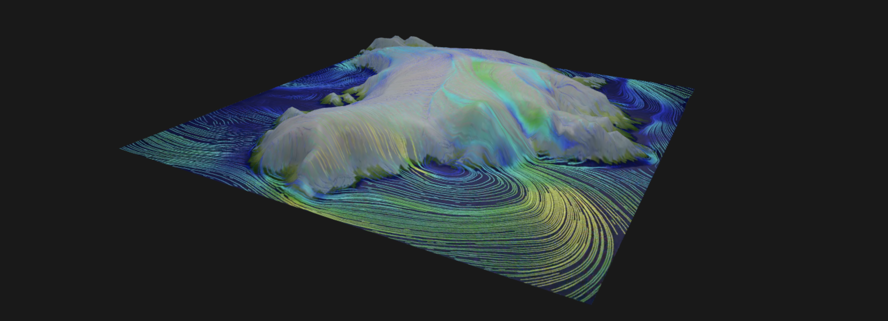

<section>
    
</section>

# A Test Interactive Visualization

This is a visualization adapted for testing interactive 3D capabilities on the web. It depicts wind speed data from a simulation using the System for Integrated Modeling of the Atmosphere (SIMA) variable-resolution grid over Greenland.

- Computational Modeling: Adam Herrington (NCAR/CGD)
- Visualization: Matt Rehme (NCAR/CISL), Adam Herrington (NCAR/CGD)

